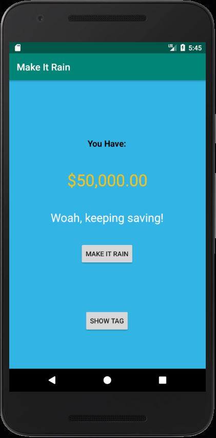
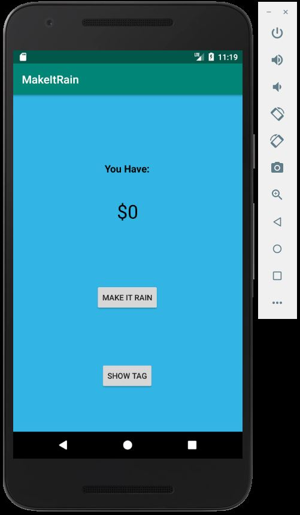
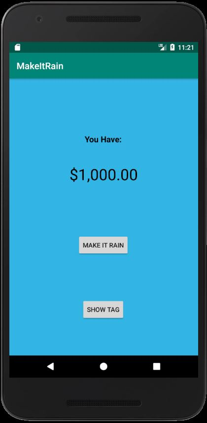
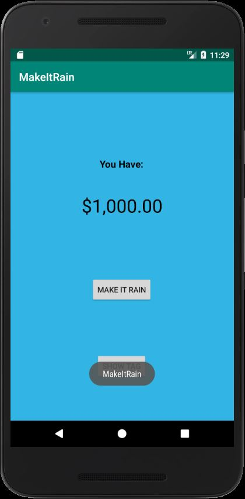

# Project: Make It Rain

Notice in the Nexus 5X API 25 emulator demo, the total saving is $50,000
, the text is yellow and there is a message displayed indicating the user is
doing a great job saving money.

**Figure: "Make It Rain" Android Emulator Demo**

## Overview

The purpose of this project was to implement a Java Android Application
that allows people to make/save money. The "Make It Rain" Android application
simulates the deposit feature of an ATM machine. The user deposits $1000 into
the ATM. Similarly, the user clicks on the "Make It Rain" button, which adds
$1000 to their total savings.

## Contents

- **app**: contains the contents of our Android Application
- **[MainActivity.java](./MakeItRain/app/src/main/java/com/guzmanx/makeitrain/MainActivity.java)**:
contains Java source code for this project
- **gradle**: build automation tool for building, cleaning and running Java application
- **[res](./MakeItRain/app/src/main/res)**: contains the resources used in designing the android
app user interface. Ex: layout, buttons, text, background, etc

## How To Use Android App

Initially when opening application, you will start with $0.

1\. Click on "Make It Rain" button

You will notice your money increments by $1000 each click.

Once $10,000 dollars is reached, the text changes from black
to yellow. Once $50,000 dollars is reached, text appears
"Woah, keeping saving".

2\. Click on "Show TAG"

You will notice text will pop up indicating which button to
 use to interact with the app. In our case, "MakeItRain".

## Versions

- Android Studio io 3.5.3
- Emulator Nexus 5X API 25

## Resources

- [The Comprehensive 2020 Android Development Masterclass](https://www.udemy.com/course/android-development-java-android-studio-masterclass/)
    - Section 8: Android Development - Let the fun Begin
    - 51 - 57. Building a "Make it Rain" App
